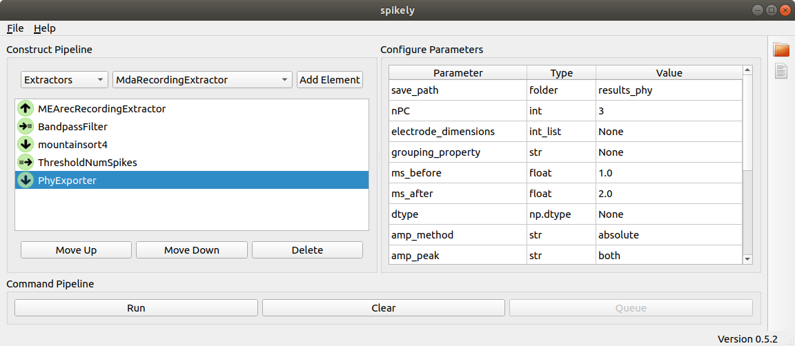

# spikely 
An application built on top of SpikeInterface to create and run extracellular
data processing pipelines within a GUI. Spikely currently supports loading, preprocessing,
sorting, and curating extracellular datasets that are stored in SpikeInterface
compatible file formats.

## Setup

To run spikely first you must install it:

```
pip install spikely
```

Once installed, spikely can be launched from the command line:

```
spikely
```

## Documentation 
All documentation for spikely can be found here: https://spikely.readthedocs.io/en/latest/.

## Screenshot



## Authors

[Roger Hurwitz](mailto:rogerhurwitz@gmail.com?subject=Spikely) - Portland, Oregon, USA

[Cole Hurwitz](https://colehurwitz.github.io/) - The Institute for Adaptive and Neural Computation (ANC), University of Edinburgh, Edinburgh, Scotland 

[Shawn Guo](http://www.shawnguo.cn/) - The Institute for Adaptive and Neural Computation (ANC), University of Edinburgh, Edinburgh, Scotland 
