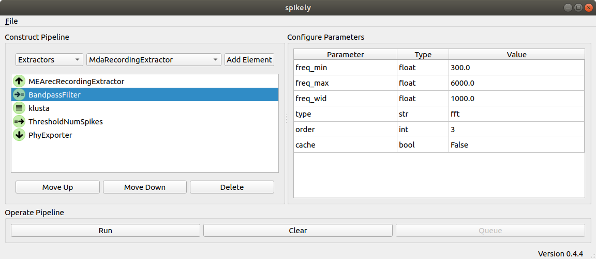

===================================
spikely
===================================

Extracellular data processing made simple
=========================================

.. _SpikeInterface: https://github.com/SpikeInterface

Spikely is an application built on top of SpikeInterface_ designed to simplify
the process of creating and running extracellular data processing pipelines.
Spikely supports loading, preprocessing, sorting, and curating extracellular
datasets that are stored in SpikeInterface_ compatible file formats.

Contents
========
.. toctree::
   :maxdepth: 1

   overview
   workflow

Indices and tables
==================
* :ref:`genindex`
* :ref:`modindex`
* :ref:`search`
