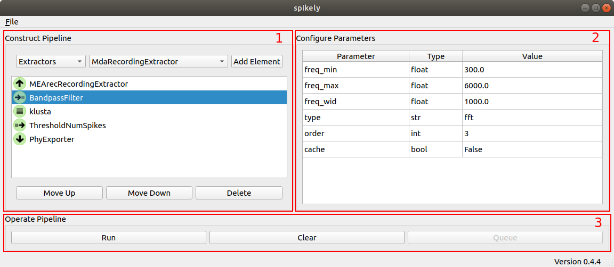

Workflow
========

.. _SpikeInterface: https://github.com/SpikeInterface

With a solid grounding in SpikeInterface_, and a grasp of spikely's element,
parameter, and pipeline abstractions, the last piece of the puzzle to unlocking
spikely's potential is understanding its workflow and associated UI layout.

At a high level spikely's workflow consists of creating a pipeline of elements,
configuring the parameters associated with those elements, and finally, running
the pipeline to cause extracellular data to be brought into the pipeline by the
Extractor and transformed by the other elements in the pipeline flow.

1. **Constructing the Pipeline** - The user constructs a pipeline in spikely by
   choosing the element category (e.g., *Recording Extractors*), choosing one
   of the installed elements within that category (e.g.,
   *MdaRecordingExtractor*) and then adding that element to the pipeline using
   the "Add Element" button. Individual elements added to the pipeline can be
   moved up, moved down, or deleted as part of pipeline construction process.
   Note, there are pipeline policies enforced by spikely related to ordering
   and singularity that limit certain pipeline permutations.

2. **Configuring Element Parameters** - When an element is selected in the
   *Construct Pipeline* part of the UI that element's parameters are displayed
   in the *Configure Elements* part of the UI. Element parameters are specific
   to it, so a detailed explanation of an element's parameters will need to be
   gleaned from the corresponding SpikeInterface_ documentation.  Clicking on
   the *Value* field for a parameter enables the user to edit it.  Spikely does
   rudimentary type checking, but for the most part it is up to the user to
   ensure that a parameter value is valid.

3. **Commanding the Pipeline** - While the commands available to the user in
   the *Construct Pipeline' part of the UI operate on individual elements in
   the pipeline, *Command Pipeline* commands act on the pipeline as a whole.
   Currently, two operations are supported: *Run*, and *Clear*.  *Clear*
   deletes all the elements in the pipeline enabling the user to quickly tear
   down the current pipeline before building up a new one.  *Run* is where the
   magic happens, instantiating the pipeline and transforming the extracellular
   data as it flows from the source element (Recording Extractor) to the sink
   element (Sorter or Sorting Exporter).

.. tip::
   The pipeline creation and parameter configuration steps can be shortcut by
   saving and loading complete pipelines to/from files using the corresponding
   actions from spikely's *File Menu.*
